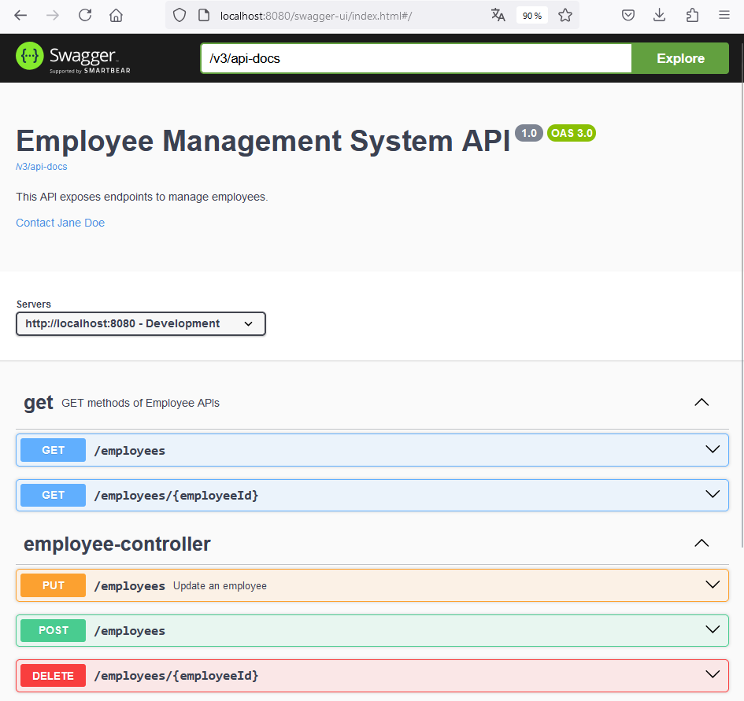

# Swagger Demo Application 
A demo project demonstrating how to use Swagger (based on OpenAPI 3.0 specification) with Spring Boot to document RestAPI.

Tech stack:
- Maven
- Java 17
- Spring Boot 3.1
- H2 
- Swagger UI

Activate Swagger UI in the project   

```xml
<dependency>
   <groupId>io.springfox</groupId>
   <artifactId>springfox-swagger-ui</artifactId>
   <version>2.9.2</version>
</dependency>
```

`$ mvn17 spring-boot:run`  

http://localhost:8080/swagger-ui.html#/  



---

Refs:  
[Spring Boot With H2 Database](https://www.baeldung.com/spring-boot-h2-database)  
[Documenter une API REST de Spring Boot avec Swagger](https://medium.com/@cindanojonathan.fr/documenter-une-api-rest-de-spring-boot-avec-swagger-78e12510ea35)

---

# Tips

**mvn17.cmd**  

```batch
@echo off

@REM Remember to add PATH to this file...

echo "      ____.                      _____________   "
echo "     |    |____ ___  _______    /_   \______  \  "
echo "     |    \__  \\  \/ /\__  \    |   |   /    /  "
echo " /\__|    |/ __ \\   /  / __ \_  |   |  /    /   "
echo " \________(____  /\_/  (____  /  |___| /____/    "
echo "               \/           \/                   "
echo "                                                 "

SET JAVA_HOME=C:\home\bin\jdk-17
CALL "C:\home\bin\apache-maven-3.9.5\bin\mvn.cmd" %*
```

**mvn17.sh**  

```bash
#!/usr/bin/bash
export JAVA_HOME="/cygdrive/c/home/bin/jdk-17"
echo "      ____.                      _____________   "
echo "     |    |____ ___  _______    /_   \______  \  "
echo "     |    \__  \\  \/ /\__  \    |   |   /    /  "
echo " /\__|    |/ __ \\   /  / __ \_  |   |  /    /   "
echo " \________(____  /\_/  (____  /  |___| /____/    "
echo "               \/           \/                   "
mvn $@ 
```
